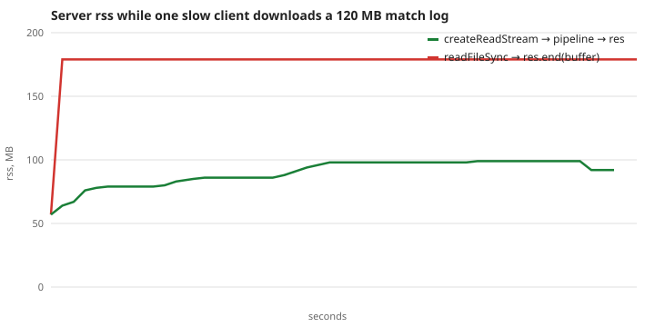

# Dogfight — Lab 04: Node.js, EventEmitter, streams, WebSocket

Клієнт із Lab 1–3 лишився в `client/`, поруч з'явився `server/` на Node. Сервер віддає зібраний клієнт, тримає кімнати, вхід/вихід і чат по WebSocket, пише лог матчу потоком. Координати кораблів ще не передаються (Lab 5): гра локальна, сервер знає лише, хто в кімнаті.

## Запуск

```bash
nvm use && npm install          # npm workspaces: client + server
npm run dev                     # сервер :3000 (node --watch) + Vite :5173 (проксі /api, /ws, /health)
npm run build && npm start      # прод: сервер сам віддає client/dist на :3000
npm test && npm run lint
```

Для демонстрації відкрий `http://localhost:5173` у **двох вікнах**: «New room», обери кімнату, Join, пиши в чат (`Enter` фокусує чат, `Esc` виходить із чату, `Esc` поза чатом повертає в лобі).

Конфіг тільки з оточення, перевіряє `server/src/config.js` (усі помилки за раз, код виходу 2):

| змінна                                 | типово        | зміст                                       |
| -------------------------------------- | ------------- | ------------------------------------------- |
| `PORT`                                 | 3000          | 0–65535 (0 = вільний порт)                  |
| `LOG_DIR`                              | `server/logs` | каталог для `server.log` і `match-*.ndjson` |
| `CLIENT_DIST`                          | `client/dist` | що віддавати як статику                     |
| `HOST`                                 | 0.0.0.0       | адреса прослуховування                      |
| `MAX_MESSAGE_BYTES`                    | 2048          | більший кадр = закриття 1009                |
| `RATE_PER_SEC`                         | 10            | token bucket на сокет                       |
| `JOIN_TIMEOUT_MS` / `PING_INTERVAL_MS` | 5000 / 15000  | вікно на `join` / період ping               |
| `MAX_BUFFERED_BYTES`                   | 65536         | поріг `bufferedAmount`, див. нижче          |

## Структура

```
client/                          Lab 1–3 + net/socket.js (черга + reconnect), ui/chatView.js
server/src/
  index.js     entry: config → app → SIGINT/SIGTERM → код 0
  app.js       збирає logger + registry + http + ws; start()/stop() (graceful)
  config.js    ConfigError, перевірка змінних
  http.js      node:http: статика (без ".."), /api/rooms GET+POST, /api/matches, /health
  ws.js        ws: upgrade /ws, join-таймер, ping/pong, ліміт, backpressure
  protocol.js  parseMessage → {ok,msg} | {code,reason}; коди закриття
  room.js      class Room extends EventEmitter
  registry.js  Map<id, Room>; порожня кімната видаляється; лог матчу на кімнату
  matchlog.js  NdjsonTransform, MatchLog (pipeline), streamReplay
  limiter.js send.js logger.js
server/scripts/   phases.mjs, eventloop-demo.mjs, rss-demo.mjs
docs/rss.svg      графік rss
```

## Протокол

JSON у текстових кадрах. Клієнт → сервер: `join {room, name}`, `chat {text ≤ 200}`, `leave`. Сервер → клієнт: `welcome {you, room, players}`, `joined {player}`, `left {id}`, `chat {from, name, text, ts}`, `error {code, message}`. Із кожного повідомлення беруться лише відомі поля.

| порушення                                                           | код закриття |
| ------------------------------------------------------------------- | ------------ |
| бінарний кадр                                                       | 1003         |
| не JSON                                                             | 1007         |
| невідомий `type`, зламана форма, `chat` до `join`, повторний `join` | 1008         |
| кадр більший за ліміт (це робить `ws` через `maxPayload`)           | 1009         |
| немає `join` за 5 с                                                 | 4001         |
| перевищено ліміт повідомлень                                        | 4002         |
| кімната повна / не існує                                            | 4003 / 4004  |
| вимкнення сервера                                                   | 1001         |

Клієнтська обгортка не перепідключається після 1008/1009/4001–4004 (сервер відхилив свідомо), після інших розривів чекає `min(10 с, 500 мс · 2ⁿ) · (0.5…1)`. `send()` під час розриву кладе повідомлення в чергу (до 50), а після перепідключення спочатку йде `join`, потім черга.

**Ping.** Раз на `PING_INTERVAL_MS` (15 с) сервер шле ping і збільшує лічильник пропущених; `pong` скидає його. Якщо два ping поспіль без відповіді, на наступному тику сокет `terminate()`.

**Backpressure у WebSocket.** `ws.send` не блокує, а складає дані в пам'ять. Якщо `ws.bufferedAmount` > 64 КБ, `chat`/`joined`/`left` цьому клієнтові **не** шлемо (`trySend`), критичні `welcome`/`error` шлемо завжди. Один повільний клієнт так не роздуває пам'ять сервера.

## Node проти браузера, ESM проти CommonJS

У Node немає `window`/DOM/`requestAnimationFrame`, зате є `fs`, `http`, `process`, `Buffer`, потоки й сигнали ОС. Event loop той самий принцип (один потік JS + черги), але реалізований у **libuv**, а не в браузері. Сервер написано як ESM (`"type": "module"`): `import`/`export`, `import.meta.dirname` замість `__dirname`, top-level `await` у `index.js`. CommonJS (`require`, `module.exports`) завантажується синхронно й динамічно, ESM статично й асинхронно; `require` ESM-пакета раніше був неможливий, і через це нові бібліотеки дедалі частіше виходять лише як ESM.

### Фази libuv

Порядок: **timers → pending callbacks → idle/prepare → poll (I/O) → check (`setImmediate`) → close callbacks**; між колбеками `process.nextTick`, потім мікрозадачі промісів. `npm run demo:phases -w @dogfight/server` (усередині I/O-колбека порядок детермінований):

```
io: nextTick
io: promise
io: setImmediate
io: setTimeout 0
```

Після poll йде check, тому `setImmediate` виконується раніше за таймер, який треба ще дочекатися. З головного модуля порядок `setTimeout 0` і `setImmediate` не гарантований.

## Потоки: лог матчу і повтор

`Room` емітить `join`/`leave`/`chat`; `RoomRegistry` пише ці події в `MatchLog`: `Readable` (object mode) → `NdjsonTransform` (`JSON.stringify(event) + "\n"`) → `createWriteStream`, усе під `stream/promises.pipeline` (помилка в будь-якій ланці руйнує всі, файл закривається). Файл створюється з першою подією, а порожня кімната завершує потік. Повтор: `GET /api/matches/<ім'я>` це `pipeline(createReadStream(file), res)`; файл у пам'ять не читається, а на закритий клієнтом сокет `pipeline` сам руйнує обидва потоки.

### Графік rss

`npm run demo:rss -w @dogfight/server`: 120 МБ NDJSON, один повільний клієнт (~10 МБ/с), rss сервера кожні 200 мс.



| варіант                                 | rss на старті | максимум   |
| --------------------------------------- | ------------- | ---------- |
| `createReadStream` → `pipeline` → `res` | 57 МБ         | **99 МБ**  |
| `readFileSync` → `res.end(buffer)`      | 57 МБ         | **179 МБ** |

Потоковий варіант виходить на плато за ~5 с і далі пласка, хоча завантаження йде ще ~5 с. Перші ≈40 МБ це розігрів V8 та аллокатора (буфери по 64 КБ), а не ріст з розміром файлу. Наївний варіант додає рівно розмір файлу (+120 МБ), і так було б для кожного одночасного клієнта.

**Чому плато.** `res` (Writable) повертає `false` із `write()`, коли її внутрішній буфер перевищив `highWaterMark`; `pipeline` тоді ставить `createReadStream` на паузу й чекає `drain`. Читання з диска тож іде в темпі найповільнішого споживача, у пам'яті лежить кілька чанків по 64 КБ.

## Запис: що буде, якщо обробник займе цикл подій на 300 мс

`npm run demo:loop -w @dogfight/server` (сервер у дочірньому процесі, клієнт міряє ззовні):

```
/fast (без блокування)                       6 ms, 6 ms, 10 ms
/block (синхронний цикл 300 мс)            302 ms
/fast, надіслано через  40 мс після /block 264 ms
/fast, надіслано через  80 мс після /block 221 ms
/fast, надіслано через 120 мс після /block 182 ms
event-loop delay сервера (max)             312 ms
```

JS-код виконується в одному потоці й до завершення. Поки йде синхронний цикл, event loop не доходить до poll-фази: нові з'єднання, усі інші запити, таймери та pong-відповіді на ping стоять у черзі. «Швидкі» запити платять майже всі 300 мс. Для цієї гри це означало б 300 мс без чату в усіх кімнатах (а в Lab 5 ще й зависання симуляції в усіх), а два пропущені pong поспіль уже можуть розірвати здорових клієнтів. Лікування: нічого важкого синхронно в обробниках (стрімінг замість `readFileSync`, `await` на I/O), а справжнє CPU-навантаження виносять у `worker_threads` або окремий процес.

## Запис: чому `"error"` без слухача валить процес

`EventEmitter` обробляє подію `"error"` особливо: якщо слухачів немає, `emit("error", err)` **кидає** `err` синхронно. Виняток піднімається з того місця, де викликано `emit`, у типовому випадку з колбека без `try/catch`, тобто стає `uncaughtException` і процес завершується з кодом 1, разом з усіма кімнатами й сокетами. `npm run demo:loop` показує обидва варіанти:

```
emit('error') БЕЗ слухача:  exit code 1, тикі встигли лише 2, stderr: Error: send failed
той самий код З слухачем:   exit code 0, тиків 7, handled: send failed
```

Тому `RoomRegistry` завжди вішає `room.on("error", …)` (одна кімната з відмовленим `send` не повинна ламати інші), `ws` сокети мають `ws.on("error", …)` (`ws` емітить `error` при переповненому кадрі), а потоки (`createWriteStream` у логері) теж. Тест `Room: … 'error' event without a listener throws` фіксує це.

## Як перевірено

`npm test`: клієнт 27 тестів, сервер 16: конфіг; шляхи без `..`; усі порушення протоколу з кодами 1003/1007/1008/1009/4001/4002/4003/4004; ліміт; backpressure на фейковому сокеті; `Room`/реєстр і NDJSON; HTTP (`/health`, GET/POST `/api/rooms`, 400/404/405/413/415, статика); два клієнти й чат; видалення порожньої кімнати та потоковий повтор; ping/pong із клієнтом, який мовчить (розрив 1006); `SIGTERM` дочірнього процесу (сокети отримують 1001, лог закрито, код 0). Тест `SIGTERM` пропускається на Windows (там немає сигналів POSIX); `Ctrl+C` (`SIGINT`) на Windows працює.

Обмеження: гра досі локальна; кімната, у яку ніхто не заходив, лишається, доки хтось не зайде й не вийде; Origin не перевіряється; збої Lab 3 `?fault=…` працюють лише у `npm run dev`.

## Definition of Done

- [x] `client/` + `server/`, npm workspaces, `GET/POST /api/rooms`, `/health`, статика без `..`
- [x] Конфіг із оточення, graceful shutdown, код 0
- [x] `Room extends EventEmitter`, порожня кімната видаляється, валідація, `join` 5 с, ping, ліміт, `bufferedAmount`
- [x] Обгортка сокета: черга і reconnect із наростаючою паузою
- [x] Лог матчу через `pipeline`, повтор потоком, графік rss, записи про цикл подій і `"error"`
- [ ] Тег `lab-04`
