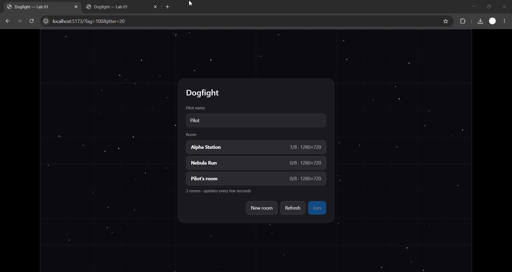

# Dogfight — Lab 05: сервер рахує гру

Двоє грають в одній грі. Клієнт шле **input** (газ, поворот, постріл) і `seq`, а не координати. Світ рахує лише сервер (30 кроків/с) і розсилає знімки. Свій корабель клієнт передбачає й звіряє зі знімком, чужі малює трохи в минулому між двома знімками.

> У цій лабі гра зведена до кораблів і куль, бо мережа вимагає простого серіалізованого стану. Астероїди, pickup і homing із Lab 2–3 лишилися в `lab_02`/`lab_03`.

## Запуск

```bash
nvm use && npm install          # workspaces: shared + client + server
npm run dev                     # сервер :3000 + Vite :5173 (проксі /api, /ws)
npm test && npm run lint
npm run bench -w @dogfight/shared                 # JSON проти binary
node client/scripts/netlab.mjs                    # усі таблиці цього README (~1.5 хв)
```

Відкрий `http://localhost:5173` у **двох вікнах**: створи кімнату, Join (керування `←/→`/`A/D`, `↑`/`W` газ, `Space` вогонь, `Enter` чат, `Esc` вихід). Мережеві перемикачі в URL (для першого вікна або обох):

| параметр                    | зміст                                                             |
| --------------------------- | ----------------------------------------------------------------- |
| `?predict=0`                | без передбачення: свій корабель теж рухається лише після знімка   |
| `?lag=100&jitter=20&loss=5` | штучні RTT (мс), розкид (±мс) і втрата пакетів (%), у обидва боки |
| `?format=json`              | JSON замість бінарного протоколу                                  |
| `?chaos=10`                 | навмисний `Math.random()` у передбаченні (експеримент)            |
| `?interp=100`               | затримка інтерполяції чужих кораблів, мс                          |

## Архітектура

```
shared/src   sim.js (applyInput, stepWorld, seeded rng)   codec.js (DataView)   constants.js   math.js
server/src   ticker.js (30 Гц без setInterval)   game.js (RoomGame: черги input → stepWorld → знімки)   ws.js (+Lab 4)
client/src/net   session.js   prediction.js   interpolation.js   smoother.js   netsim.js   stats.js   socket.js
client/src/render/drawGame.js   сцена, scoreboard, netgraph
```

**`shared/`** запускається в браузері й у Node: ESLint забороняє там `window`, `process`, `Buffer`, `node:*`, `Date`, `performance`, `setTimeout` і `Math.random`, а тест перевіряє вихідні файли на ті самі токени. Єдина випадковість це `mulberry32` на `world.rngState` від `seed` кімнати: порядок викликів фіксований (кораблі відсортовані за id), тому в обох середовищах відтворюється те саме. `applyInput(ship, input, dt)` це **та сама функція**, яку викликають і `stepWorld` на сервері, і `Predictor` на клієнті.

**Сервер** (`ticker.js`): кожен тік має цільовий час `start + n·період`; після пробудження виконуємо всі тіки, що настали, і спимо до наступної цілі. Запізнілий таймер так не накопичує дрейф (тест із таймерами, що спізнюються на 0/7/20 мс, дає 298–301 тік за 10 с). Якщо відстали більше ніж на 5 тіків, зайві тіки пропускаються без спіралі. `setInterval` у файлі немає, тест це перевіряє. Корабель крокує лише коли для нього є input: його стан залежить тільки від послідовності input, яку клієнт і програє. Черга понад 5 input скорочується до 3 найновіших (лічильник `droppedInputs`).

**Клієнт.** Кожен тік (30 Гц) `GameSession.step()` читає клавіші, шле `{seq, buttons}` і одразу застосовує його локально. Знімок містить у записі корабля `lastSeq`, тобто останній оброблений сервером input.

1. Клієнт викидає підтверджені input (`seq ≤ lastSeq`), рахує RTT як час від надсилання input до знімка з цим `lastSeq`.
2. Бере стан свого корабля **зі знімка** і заново програє input, яких сервер ще не бачив (`applyInput`).
3. Різниця між новою і старою позицією це **поправка** (на netgraph). Вона не стрибком, а `Smoother`ом: корабель малюється в `передбачено + зсув`, зсув лінійно зникає за 100 мс. Поправка більша за 150 одиниць (респаун) застосовується відразу.
4. **Свої кулі** з'являються одразу. Вони зв'язані зі знімком через `fireSeq`: якщо сервер уже обробив цей input, а такої кулі в знімку немає (влучила або згасла), клієнт її теж прибирає.
5. **Чужі кораблі й кулі** малюються в минулому на `interp` мс (за замовчуванням 100 мс = 3 тіки) між двома знімками, що оточують цей момент; кути й координати інтерполюються найкоротшим шляхом через край арени.

## Бінарний протокол

DataView, little-endian, перший байт це версія протоколу (інша версія = `ProtocolError`, сокет закривається 1008). Бінарні кадри це input (клієнт → сервер) і знімок (сервер → клієнт); чат, `join` та інше лишаються JSON-текстом.

```
input    (7 Б):  u8 версія | u8 тип=1 | u32 seq | u8 кнопки (1 газ, 2 вліво, 4 вправо, 8 вогонь)
snapshot (9 Б + 28·кораблів + 24·куль):
  заголовок: u8 версія | u8 тип=2 | u32 tick | u8 кораблів | u16 куль
  корабель:  u8 id | u8 прапори | u8 hp | u8 cooldown | u16 score | i16 кут | f32 x y vx vy | u32 lastSeq
  куля:      u16 id | u8 власник | u8 ttl | f32 x y vx vy | u32 fireSeq
```

Кут це `i16`, `кут·32767/π`: точність ≈ 1·10⁻⁴ рад. Позиції `f32` (≈ 10⁻⁴ при 1280). Така квантизація і є причиною дрібної відмінності від «ідеального» стану.

### JSON проти binary (`npm run bench -w @dogfight/shared`)

| сцена (кораблі+кулі) | JSON, байт | binary, байт | менше у | JSON, KB/с на клієнта | binary, KB/с | encode+decode JSON, мкс | binary, мкс |
| -------------------- | ---------- | ------------ | ------- | --------------------- | ------------ | ----------------------- | ----------- |
| 2+0                  | 481        | 65           | 7.4×    | 14.1                  | 1.9          | 8.5                     | 2.6         |
| 2+6                  | 1272       | 209          | 6.1×    | 37.3                  | 6.1          | 21.2                    | 3.8         |
| 8+24                 | 4971       | 809          | 6.1×    | 145.6                 | 23.7         | 78.1                    | 3.1         |

Input: JSON 41 байт (`{"type":"input","seq":123456,"buttons":9}`), binary 7 байт. Виміряно на живому сервері двома клієнтами (`netlab.mjs`, 2 кораблі + кулі): **↓ 24 139 Б/с проти 3 654 Б/с, ↑ 1 155 проти 210 Б/с**. Бінарний знімок також у 3–6 раз швидше кодується й розбирається.

## Експерименти (`node client/scripts/netlab.mjs`, два справжні клієнти, повний сервер у процесі)

**Поправки та трафік** (`середня/p95/макс` у px; клієнт крутиться по колу й стріляє):

| сценарій                     | середня | p95  | макс | ↓ B/s | ↑ B/s | RTT мс |
| ---------------------------- | ------- | ---- | ---- | ----- | ----- | ------ |
| binary, lag 0                | 0.00    | 0.00 | 0.00 | 3654  | 210   | 21     |
| json, lag 0                  | 0.00    | 0.00 | 0.00 | 24139 | 1155  | 12     |
| binary, RTT 100              | 0.00    | 0.00 | 0.00 | 3678  | 210   | 140    |
| binary, RTT 100 ±20          | 0.11    | 0.00 | 5.68 | 3702  | 210   | 125    |
| binary, RTT 100 ±20, loss 5% | 0.38    | 4.20 | 8.19 | 3678  | 210   | 117    |
| chaos 2, RTT 100             | 0.13    | 0.26 | 0.34 |       |       |        |
| chaos 10, RTT 100            | 0.77    | 1.38 | 1.85 |       |       |        |
| chaos 50, RTT 100            | 3.61    | 6.88 | 9.27 |       |       |        |

**Від натискання до руху свого корабля на екрані** (поріг руху 0.3 px):

| режим                     | мс  |
| ------------------------- | --- |
| без передбачення, RTT 100 | 234 |
| з передбаченням, RTT 100  | 20  |
| без передбачення, RTT 0   | 116 |

**Затримка інтерполяції** (RTT 100 ±40, loss 3%; «кадр без знімка» це момент, коли ми малюємо в майбутньому відносно останнього знімка і мусимо екстраполювати):

| `interp`            | знімків/с | кадрів без знімка |
| ------------------- | --------- | ----------------- |
| 33 мс (1 тік)       | 23.7      | 36.2%             |
| 66 мс (2 тіки)      | 23.5      | 7.8%              |
| **100 мс (3 тіки)** | 25.0      | **0.0%**          |
| 150 мс (4.5 тіка)   | 23.5      | 0.0%              |

(Знімків ≈ 24/с замість 30, бо 3% втрат і перевпорядкування: застарілий знімок із меншим tick викидається.) Числа залежать від машини; між запусками вони коливаються, порядок величин стабільний.

## Запис про мережу

**Затримка.** Без передбачення свій корабель починає рухатися через ≈ RTT + затримка інтерполяції + тік, тобто 234 мс при RTT 100 і навіть 116 мс при нульовій мережі. З передбаченням 20 мс (один клієнтський тік), хоч RTT той самий: гравець бачить наслідок своєї дії відразу. Ціна: передбачення може помилитися, і тоді клієнт виправляється.

**Розбіжність стану.** Коли мережа чиста, поправка нульова навіть при RTT 100, бо клієнт і сервер виконують один код над однаковими input, а знімок повертає клієнту його стан із точністю квантизації (< 0.01 px). З розкидом і втратами поправки з'являються: input, що загубився чи прийшов не по порядку, сервер не застосував, тому клієнт приймає серверну правду (макс 8 px при втраті 5%). **Навмисний `Math.random()` в інтеграторі** (`?chaos=`) показує механізм: поправки ростуть майже лінійно з амплітудою (0.13 → 0.77 → 3.61 px при 2 → 10 → 50), бо клієнт і сервер розходяться з кожним кроком, а звірка щоразу відновлює істину. Тому в `shared/` заборонено `Math.random` і `Date`, а випадковість проходить лише через `rngState`. Застереження: `Math.sin/cos/exp` у різних рушіях (V8, SpiderMonkey, JavaScriptCore) можуть відрізнятися в останньому розряді. Це не копичиться, бо кожен знімок «перезаряджає» клієнта серверним станом, але для lockstep довелося б мати власну математику.

**Чіти.** Координати з клієнта сервер не бере взагалі: у пакеті 4 біти кнопок і `seq`, тому «телепорт» і зміна швидкості неможливі, а `Math.random` на клієнті нічого не ламає, лише додає поправки. Швидше за інших рухатися теж не вийде: корабель крокує не більше одного разу за тік, надлишок input відкидається (черга понад 5 обрізається, ліміт 60 input/с на сокет з кодом 4002), `seq` має зростати, дублі й застарілі пакети ігноруються, будь-який зламаний бінарний кадр закриває сокет (1008). Те, що ми **не** закриваємо: wallhack (знімок містить усі кораблі, хоч би вони й не були видимі) та aimbot (це лише коректні input).

**Затримка інтерполяції: 100 мс (3 тіки).** При 30 знімках/с інтервал 33 мс, тож 66 мс покриває лише один пропущений знімок. Експеримент показує: 33 мс дає 36% кадрів без знімка (чужі кораблі смикаються), 66 мс 7.8%, а 100 мс уже 0%. 150 мс нічого не додає, але додає ще 50 мс «старості» чужих кораблів. Тому 100 мс: це найменша затримка, за якої втрата одного знімка непомітна.

## GIF двох вікон

Я не можу записати екран браузера, тому GIF зроби сам: два вікна поруч, `?lag=100&jitter=20` в одному, обидва в одній кімнаті; ShareX або ScreenToGif; покажи вогонь, влучання, респаун, netgraph (RTT, вік знімка, B/s, черга, поправка). Збережи як `docs/two-windows.gif`:



## Definition of Done

- [x] `shared/`: та сама симуляція в браузері й Node, seed-RNG, без `Math.random`/`Date`, крок 1/30 с, тести детермінізму
- [x] Сервер: 30 кроків/с цільовим часом (не `setInterval`), `seq` у кожного input, знімки всім
- [x] Передбачення + звірка (replay) + згладжування 100 мс, чужі в минулому, свої кулі одразу
- [x] DataView, little-endian, версія, кут `i16`; JSON за прапорцем; таблиця розмірів
- [x] Netgraph: RTT, вік знімка, байти/с, черга input, поправка
- [x] Штучні затримка, розкид, втрата; експеримент із випадковістю
- [x] GIF у `docs/two-windows.gif`
- [x] Тег `lab-05`
